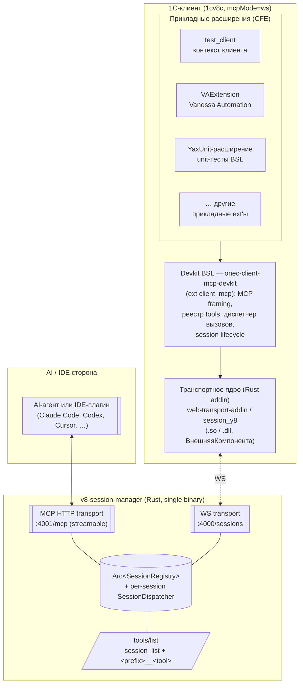

# Архитектурная схема стека

Документ описывает место `v8-session-manager` в общей картине: что подключается со стороны клиента 1С, что — со стороны AI-агента, и какие слои отвечают за что.

## Карта компонентов

## Слои и ответственности

| Слой | Артефакт | Язык / форма | Зона ответственности |
|------|----------|--------------|----------------------|
| L0. Транспорт клиента | `web-transport-addin` (он же `session_y8`) | Rust → `.so` / `.dll`, нативная внешняя компонента 1С | WebSocket-соединение к менеджеру; сериализация/десериализация фреймов; пробрасывание сообщений между BSL и менеджером; отдача external-event'ов в BSL для асинхронных нотификаций |
| L1. Devkit / MCP-ядро на клиенте | `onec-client-mcp-devkit` → расширение `client_mcp` (CFE) | BSL (1С) | Реализация MCP-протокола поверх addin: handshake, `session.register`, реестр локальных tools (агрегирует тулы из L2-расширений), диспетчер `tools/call`, soft-reconnect, idle/keepalive, FIFO per-session |
| L2. Прикладные расширения | `test_client`, `VAExtension`, `YaxUnit-runner`, иные CFE | BSL (1С) | Доменная логика, экспортируемая как MCP-tools: интроспекция контекста клиента, запуск Vanessa, запуск YaxUnit, и т.д. Регистрируют свои tools в реестр devkit'а |
| L3. Агрегатор / витрина | `v8-session-manager` | Rust (этот репозиторий) | Принимает WS-подключения клиентов, ведёт `SessionRegistry`, экспонирует объединённый MCP HTTP, маршрутизирует `<prefix>__<tool>` в нужного клиента через `SessionDispatcher` |
| L4. Потребитель | AI-агент / IDE | Любой MCP-клиент | Видит **один** MCP HTTP `:4001/mcp` с агрегированным `tools/list`. Не знает, сколько 1С-клиентов подключено и где они физически живут |

## Жизненный цикл сессии

### Регистрация

1. Внешний оркестратор (deploy-скрипт, IDE-плагин, BSL-расширение `client_mcp` со стороны DRIVE) запускает `1cv8c` с параметром `mcpMode=ws` и адресом менеджера в `/C`-параметрах.
2. После старта devkit на клиенте подключается addin'ом по WS к `:4000/sessions`.
3. Devkit формирует `SESSION_REGISTER`: `client_uid`, `prefix`, `host_id`, `pid`, и список tools, собранный из всех загруженных прикладных расширений (L2).
4. Менеджер добавляет запись в `SessionRegistry`, создаёт `SessionDispatcher` (FIFO), стартует idle-sweeper, рассылает `tools/list_changed` подключённым MCP HTTP-клиентам.

### Вызов tool

1. AI-агент вызывает `<prefix>__<tool>` через MCP HTTP `:4001/mcp`.
2. Менеджер резолвит prefix → session, кладёт вызов в `SessionDispatcher` сессии (per-session FIFO + inflight counter + bump `last_call_at`).
3. WS frame уходит в addin → devkit BSL → нужный handler в L2-расширении.
4. Результат поднимается обратно: BSL → addin → WS → менеджер → MCP HTTP → агент.

### Liveness канала (WS protocol-level Ping/Pong, RFC 6455)

Менеджер раз в `ws_ping_interval_ms` (default 20000) шлёт каждому подключённому клиенту WS Ping (opcode 0x9) прямо из writer-task в `run_connection`. Tokio-tungstenite на стороне addin отвечает Pong автоматически, **без участия BSL** — это намеренно. Для каждой сессии менеджер ведёт `last_inbound_at`: любой входящий фрейм (Pong, Text, …) обновляет таймстемп.

- Если за `ws_ping_timeout_ms` (default 30000) от клиента не пришло ни одного фрейма — writer-task закрывает sink, `CancellationToken` будит reader, тот выходит. Дальше штатный путь: WS-loop в `handle_socket` вызывает `mark_disconnected_if_generation`, через `reconnection_grace_secs` запись удаляет `run_grace_sweeper`.
- `ws_ping_interval_ms = 0` отключает Ping (например, для интеграционных сценариев, где liveness держит другая инфраструктура).

**Что мы намеренно не делаем:** application-level JSON-RPC ping не используется. Открытый модальный диалог 1С (`Вопрос(...)`, `ОткрытьФормуМодально`) или длинный серверный запрос блокируют BSL event-loop, но это **легитимные пользовательские состояния**, а не «зависание». TCP/WS канал в этот момент жив (tokio worker addin'а отвечает Pong), и менеджер не должен ложно сбрасывать сессию. Если вам нужна именно прикладная reachability — реализуйте её отдельным MCP-tool'ом, не путая с liveness канала.

### Soft-reconnect

1. WS-сокет рвётся (краш сети, перезапуск addin'а).
2. Менеджер в `mark_disconnected_if_generation` помечает запись как «отключена», но не удаляет — generation счётчик защищает от гонки со свежим коннектом.
3. Devkit при восстановлении подключается заново с тем же `client_uid` → менеджер находит запись и привязывает новый сокет, generation увеличивается.
4. Зависшие в FIFO вызовы либо переотправляются в новую инкарнацию, либо завершаются с MCP-ошибкой по таймауту (см. ADR-0021/0022/0024).

### Закрытие

- Корректное: devkit отправляет `SESSION_BYE` → менеджер `remove_if_generation`.
- Аварийное: idle-sweeper удаляет сессию по `last_call_at + idle_timeout_secs`.

## Где живёт код

| Слой | Репозиторий | Папка / артефакт |
|------|-------------|------------------|
| L0 транспорт | `web-transport-addin` (или `session_y8`) | Rust crate; собирается в `.so`/`.dll` |
| L1 devkit | `onec-client-mcp-devkit` | расширение `client_mcp` (CFE) |
| L2 прикладные ext'ы (примеры) | `onec-client-mcp-devkit` (`test_client`), `vanessa-automation`, конфигурация-носитель | CFE-расширения, подгружаемые в `1cv8c` |
| L3 менеджер | `v8-session-manager` (этот репо) | `src/session_manager/`, `src/mcp/`, `src/cli/`, `src/config/` |
| L4 потребитель | внешний | любой MCP-клиент |

## Что важно помнить

- **Менеджер не запускает 1С-клиентов.** Lifecycle 1cv8c полностью на стороне внешнего оркестратора: deploy-скрипт, devcontainer, BSL-расширение конфигурации, IDE-плагин. Менеджер — только агрегатор и точка доступа (см. ADR-0034).
- **Слои L0/L1 разделены по версии.** Транспортный addin поставляется отдельной бинарной версией (см. memory о `feedback_1c_addin_cache`: 1С кэширует addin по version в Manifest.xml). Devkit BSL заменяется через типовой механизм расширений и не требует переподключения addin'а.
- **L2 → L1 — это единственное место для прикладных tools.** Никаких «менеджерских» tools для запуска/остановки сессий больше нет (ADR-0034). Если прикладному расширению нужен новый tool — он реализуется в L2 и регистрируется через devkit.
- **Идентификация tools.** На уровне MCP HTTP имена выглядят как `<session_prefix>__<tool>` (ADR-0025). Префикс выбирается на стороне клиента и закрепляется при `session.register`.

## Связанные ADR

- ADR-0018 — WS-tunnel вместо HTTP back-connect.
- ADR-0021 — per-session FIFO как обязательный инвариант.
- ADR-0022 — soft reconnect по `client_uid`.
- ADR-0023 — двусторонний control-plane поверх одного WS.
- ADR-0024 — per-session dispatcher и lifecycle.
- ADR-0025 — публикация client tools и резолвинг имени.
- ADR-0026 — политика `tools/list_changed` уведомлений.
- ADR-0028 — origin tracking сессий и scope idle-sweeper'а.
- ADR-0029 — `host_id` + `pid` в `session.register`.
- ADR-0033 — отделение менеджера от форка v8-runner.
- ADR-0034 — минимальная MCP-поверхность менеджера.
