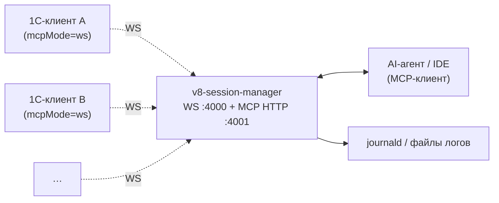

## 3. Контекст и границы системы

### 3.1 Бизнес-контекст

Менеджер стоит между набором подключённых 1С-клиентов и одним AI-агентом / IDE. Все клиенты подключаются к нему по WebSocket, а агент видит единый MCP HTTP-эндпоинт.

### 3.2 Технический контекст

Внешние интерфейсы:

- WebSocket-сервер `:4000/sessions` — приём входящих подключений 1С-клиентов; control-plane (`session.register`, `session.bye`, `tools/publish`, `tools/list_changed`) и data-plane (`tools/call`, `tools/result`) идут через один сокет (ADR-0018, ADR-0023);
- MCP HTTP сервер `:4001/mcp` — streamable transport для AI-агентов;
- YAML-конфигурация (`v8project.yaml` или путь из `--config`);
- опционально: Prometheus `/metrics` exporter;
- логирование: stdout/stderr, журналируется через journald (Linux) / Event Log+stdout-redirect (Windows) / unified log (macOS).

### 3.3 Граница системы

Внутри границы:

- терминирование WebSocket-подключений 1С-клиентов;
- in-memory `SessionRegistry` (запись на каждый `client_uid`);
- per-session `SessionDispatcher` (FIFO очередь tool-вызовов);
- агрегация и дедупликация client tools;
- маппинг `<prefix>__<tool>` ↔ `(session_id, tool_name)`;
- bidirectional notifications (`tools/list_changed`);
- liveness канала через RFC 6455 Ping/Pong;
- terminator MCP HTTP сессий (TTL, max_sessions).

За пределами границы:

- запуск 1С-клиентов (`1cv8c`) — на стороне внешнего оркестратора (ADR-0034);
- сборка/синтакс/тесты/dump 1С-конфигурации (исторически было в `v8-runner` CLI, удалено — ADR-0033);
- интеграция с RAC, sidecar-аддин для spawn в чужом host'е (ADR-0030/0031 superseded);
- реальная бизнес-логика тулов — она живёт в прикладных CFE-расширениях через devkit `client_mcp`.
