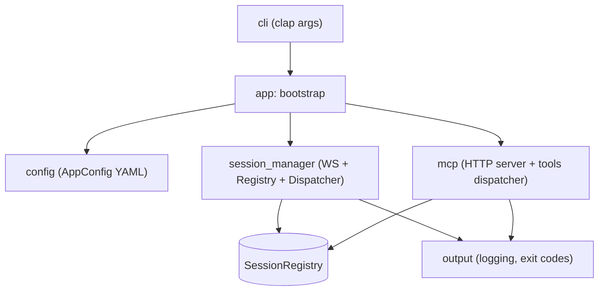

## 5. Представление строительных блоков

### 5.1 Уровень 1

Крупные блоки исходного кода:

- `cli` — плоский `clap`-парсер (`src/cli/args.rs`). Никаких подкоманд, только override-флаги поверх YAML.
- `config` — `AppConfig` + дефолты (`src/config/model.rs`). Загрузка YAML, нормализация, валидация полей.
- `app` — точка bootstrap (`src/app.rs`): загрузить конфиг, поднять логирование, поднять оба транспорта на одном `Arc<SessionRegistry>`, ждать SIGTERM, выполнить graceful shutdown.
- `session_manager` — WS-транспорт, реестр, диспетчеры, lifecycle-sweepers, нотификации (`src/session_manager/`).
- `mcp` — MCP HTTP сервер и встроенный handler `session_list` плюс прокси клиентских тулов (`src/mcp/`).
- `output` — лог-уровни, exit codes (`src/output/`).
- `support` — общие утилиты.

### 5.2 Уровень 2

#### `session_manager`

| Файл | Ответственность |
|------|------------------|
| `transport.rs` | `axum` + `tokio-tungstenite` на `:4000/sessions`. Reader-task (входящие фреймы → реестр/диспетчер), writer-task (исходящие фреймы + RFC 6455 Ping). |
| `protocol.rs` | JSON-RPC 2.0 envelope + методы control-plane (`session.register`, `session.bye`, `tools/publish`, `tools/list_changed`). |
| `registry.rs` | `SessionRegistry`: `client_uid` → `SessionRecord`. Атомарные `register_or_reattach`, `mark_disconnected_if_generation`, `remove_if_generation`. |
| `dispatcher.rs` | `SessionDispatcher`: per-session FIFO + inflight-счётчик + `last_call_at`. ADR-0021/0024. |
| `lifecycle.rs` | Idle-sweeper и grace-sweeper (асинхронные таски на общем CancellationToken). |
| `router.rs` | Маппинг `<prefix>__<tool>` ↔ `(session_id, tool_name)`. Особое поведение для `kind = vanessa_test_client` (без префикса). |
| `notify.rs` | Bidi-нотификации MCP HTTP-клиентам (`tools/list_changed`). ADR-0026. |
| `connection.rs` | Стейт WS-соединения (cancellation, last_inbound_at). |
| `management.rs` | Доменные операции над реестром, переиспользуемые транспортами. |
| `metrics.rs` | Prometheus `/metrics` exporter (опциональный). |

#### `mcp`

| Файл | Ответственность |
|------|------------------|
| `server.rs` | `rmcp`-handler: `initialize`, `tools/list` (агрегирует `session_list` + проксированные тулы), `tools/call` (резолв префикса → диспетчеризация в `SessionDispatcher`). |
| `request.rs` | DTO для `tools/call`-параметров. |
| `mod.rs` | Сборка HTTP listener'а (`axum` + `rmcp::transport::StreamableHttpService`), reservation/confirm/release flow для `max_sessions`. |
