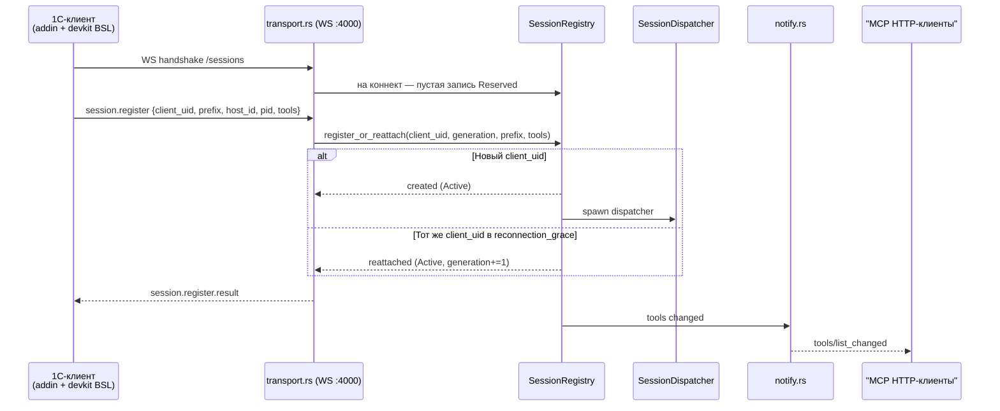
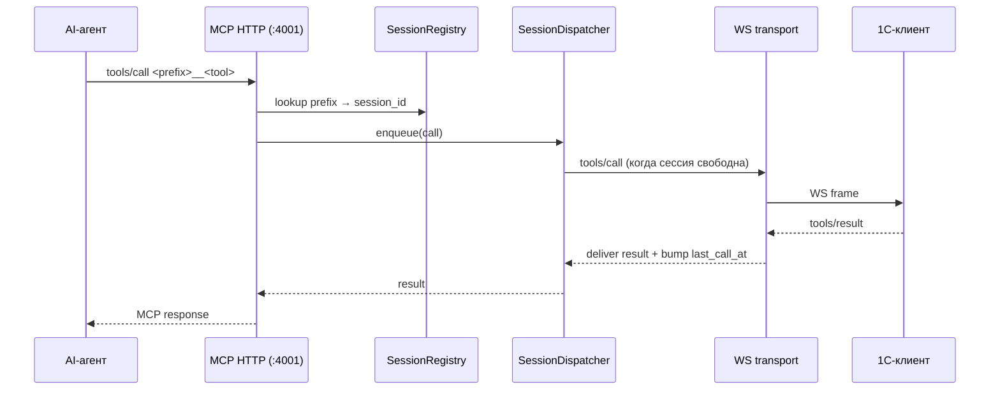
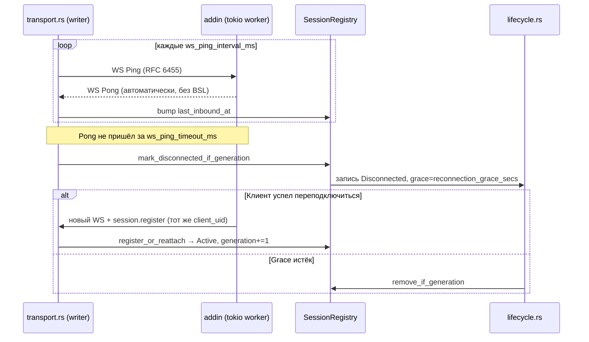

## 6. Представление времени выполнения

### 6.1 Регистрация клиента

### 6.2 Tool-вызов

Ключевые свойства:

- очередь — на сессию, а не глобальная: разные сессии исполняют параллельно;
- порядок tool-вызовов в одной сессии сохраняется (ADR-0021);
- ошибки транспорта (WS rotting / disconnect в момент вызова) маршрутизируются в MCP-ошибку с пометкой о soft-reconnect окне.

### 6.3 Liveness и soft-reconnect

### 6.4 Закрытие

- Корректное: клиент шлёт `session.bye` → `Reg::remove_if_generation`. Diff попадает в `tools/list_changed`.
- Idle: `lifecycle.rs::idle_sweeper` периодически удаляет записи с `last_call_at + idle_timeout_secs < now`. После ADR-0034 фильтр по `origin` не применяется.
- Graceful shutdown: SIGTERM → `app.rs` ставит CancellationToken, оба транспорта дренируют inflight-вызовы в пределах `mcp.execution.shutdown_grace_period_secs`.
