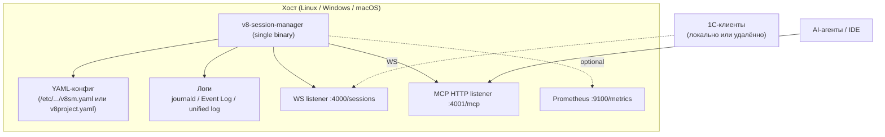

## 7. Представление развёртывания

Целевые сценарии: bare-metal сервер (systemd), Windows-хост (Windows Service через NSSM), машина разработчика (launchd/macOS или ручной запуск).

Предположения:

- процесс работает под выделенным системным пользователем (Linux: `v8sm`; Windows: `LocalService` или dedicated; macOS: текущий пользователь или `_v8sm`);
- `workPath` доступен на запись этому пользователю;
- WS и HTTP биндятся либо на loopback (production за reverse-proxy), либо на конкретный интерфейс (dev/stage);
- никакой БД, файлового реестра, persistent state менеджеру не нужно;
- если нужен внешний доступ — поверх ставится reverse-proxy (nginx/caddy/IIS) с TLS и/или Bearer-токеном (`mcp.http.auth_token`).

Конкретные шаги установки для каждой ОС — в [`docs/INSTALL.md`](../../INSTALL.md). Production-baseline конфига — `etc/v8-session-manager/v8sm.yaml`, готовый systemd-юнит — `systemd/v8-session-manager.service`.
